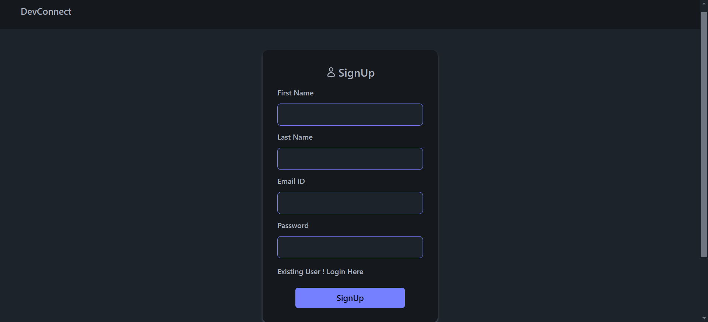
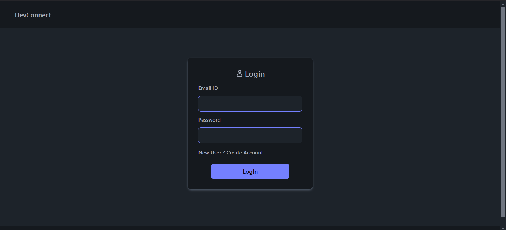
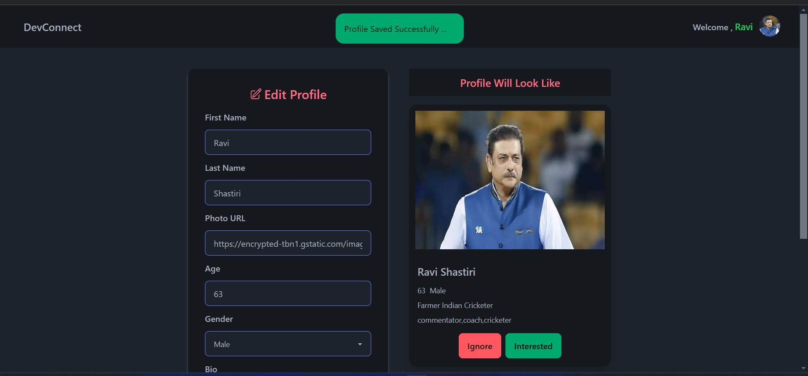
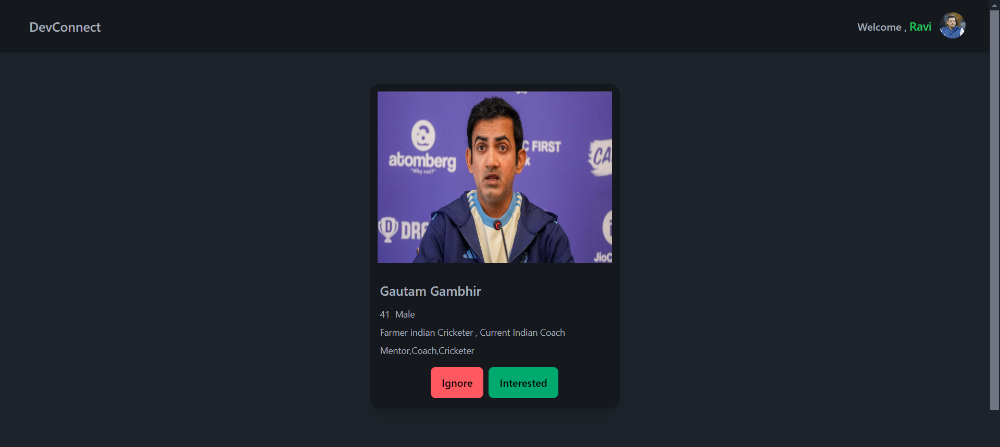
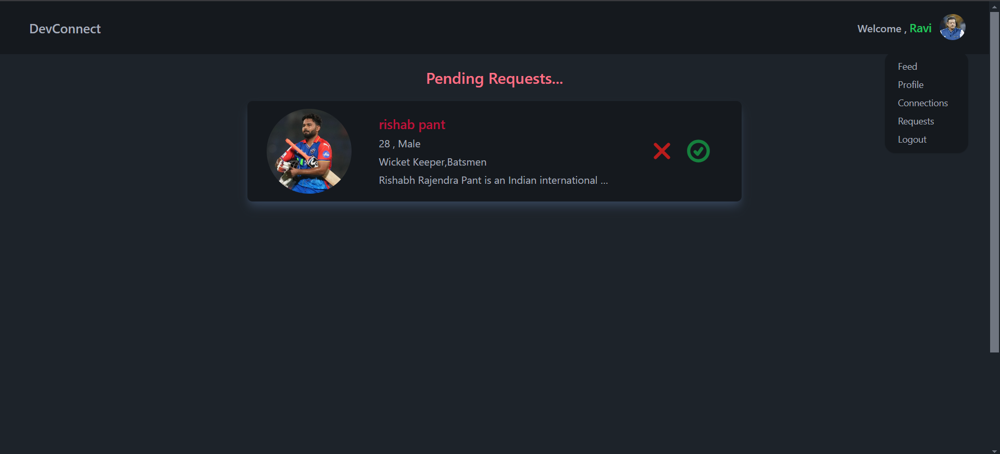
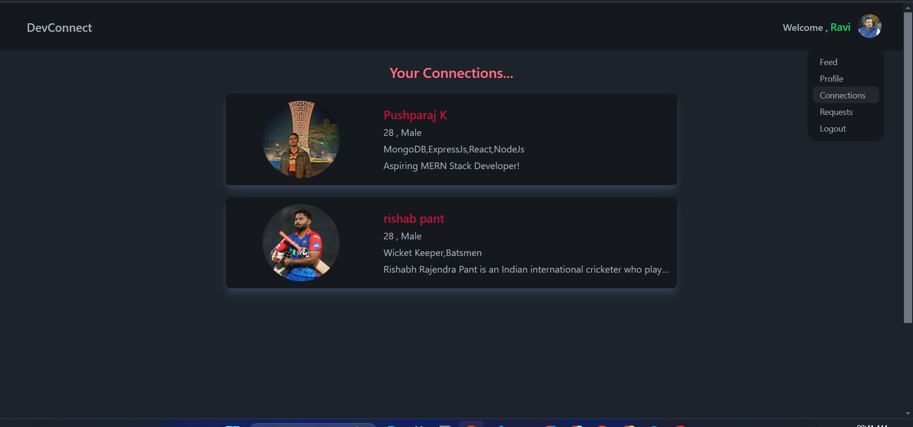

# DevConnect MERN Application

DevConnect is a modern MERN (MongoDB, Express.js, React.js, Node.js) stack application designed to facilitate user interaction through a clean and user-friendly interface. The application demonstrates the implementation of RESTful APIs for CRUD operations and provides features such as user authentication, profile management, and interaction handling.

## Features

### Backend Features
- **User Signup & Login**  
  - Users can register and log in using the `/signup` and `/login` endpoints (POST method).  
- **Profile Management**  
  - Users can edit their profiles via the `/profile` route (PATCH method).  
- **Requests Management**  
  - View received connection requests at `/requests` (GET method).  
  - Accept or reject requests using the `/requests` endpoint (POST method).  
- **Feed Interaction**  
  - View user suggestions in the feed, showing users not yet connected.  
  - Mark interest or ignore user suggestions (POST method).

### Frontend Features
- Interactive UI for seamless navigation and interactions.  
- Tailored user experience with dynamic data handling.  
- Validation using **Yup** for secure and consistent form handling.  

---

## Tech Stack

### Backend
- **Node.js**: JavaScript runtime for building the server-side logic.
- **Express.js**: Framework for handling HTTP requests and middleware.
- **Mongoose**: ODM for MongoDB, ensuring a schema-based interaction with the database.
- **Bcrypt**: Library for secure password hashing.
- **Jsonwebtoken (JWT)**: For user authentication and authorization.
- **Cookie-parser**: To parse and handle cookies for session management.
- **CORS**: Middleware to enable cross-origin requests.

### Frontend
- **React.js**: Frontend library for building the user interface.
- **Redux**: State management library for predictable and centralized state handling.
- **Tailwind CSS**: Utility-first CSS framework for responsive and modern design.
- **DaisyUI**: Component library built on Tailwind for faster UI development.
- **Yup**: Schema-based validation for user inputs.
- **Axios**: Library for making HTTP requests to interact with the backend API.
- **React Router**: For client-side routing and navigation.

---

## Screenshots

### Signup Page


### Login Page


### Edit Profile Page


### Feed


### Requests Page


### Connections Page



---

## Frontend Repository

You can find the frontend code for this project in its dedicated repository:  
[DevConnect Frontend Repository](https://github.com/Pushparaj96/DevConnect-FE)

---

## Project Structure

### Backend
- `/models`: Mongoose schemas and models.
- `/routes`: Express routes for different endpoints (authentication, profile, requests, etc.).
- `/middlewares`: Custom middlewares for authentication and request validation.

### Frontend
- `/components`: For signup, login, profile, and feed.

---

## Installation and Usage

### Prerequisites
- Node.js installed on your machine.
- MongoDB running locally or on a cloud platform like Atlas.

### Setup

1. **Clone the repository**:
   ```bash
   git clone https://github.com/your-repo/DevConnect.git
   cd DevConnect
